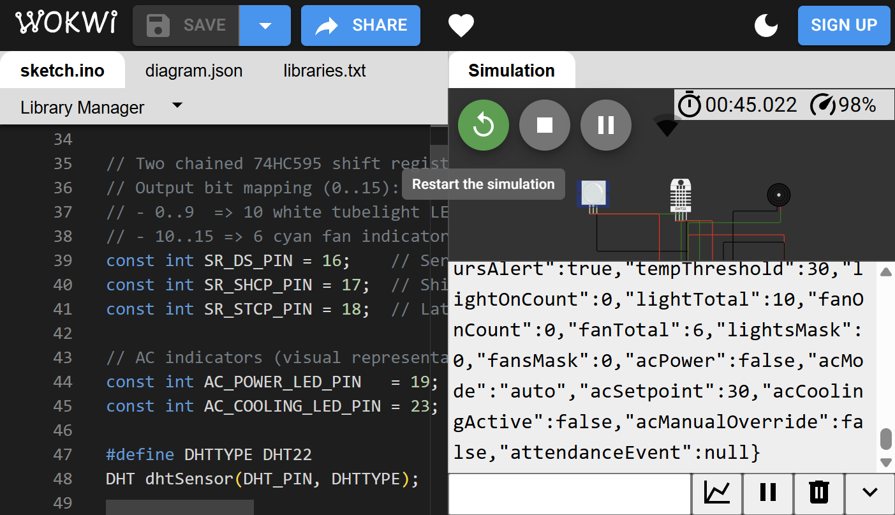
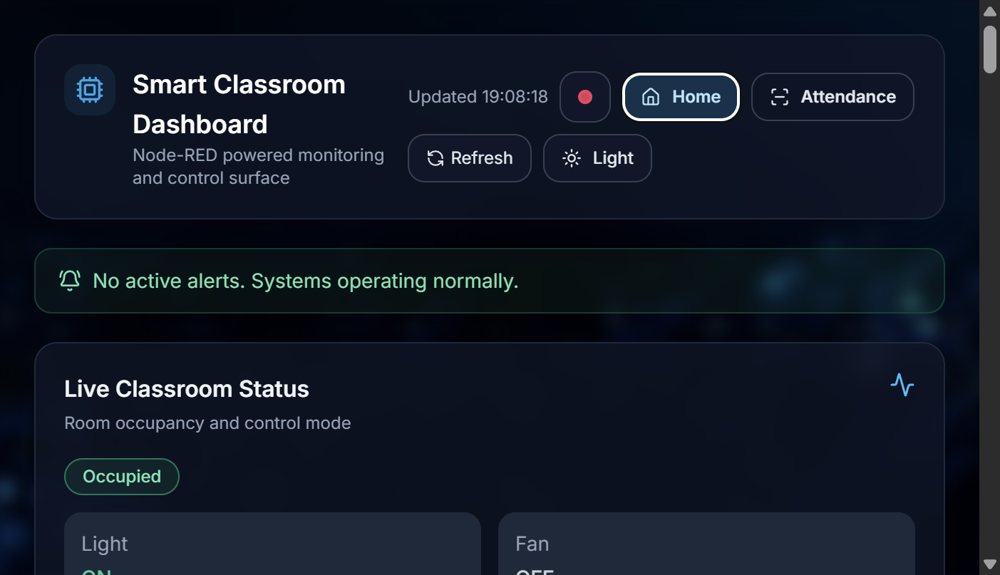
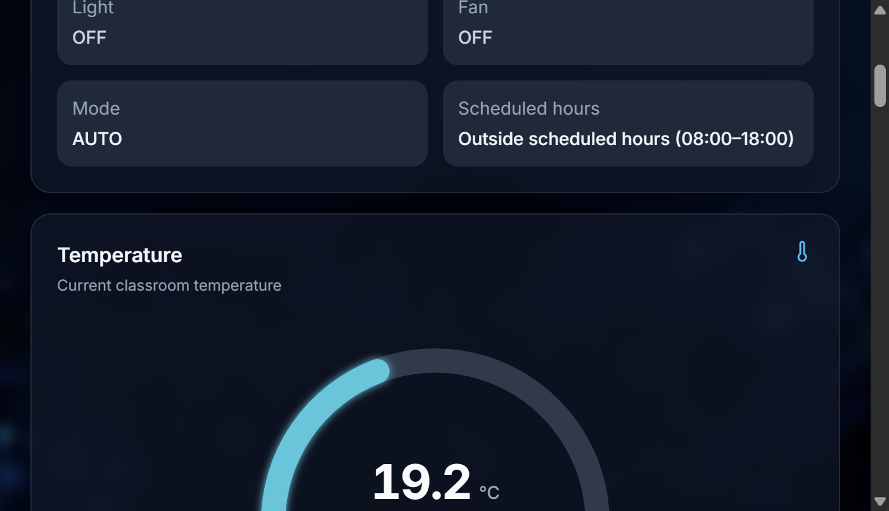
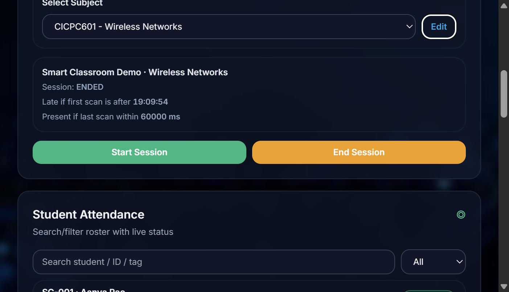
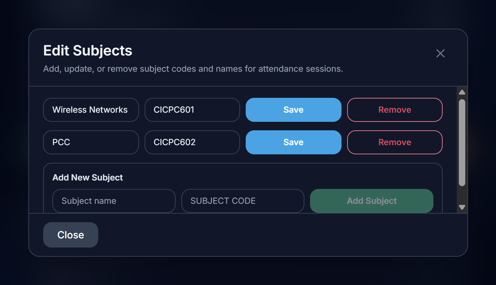
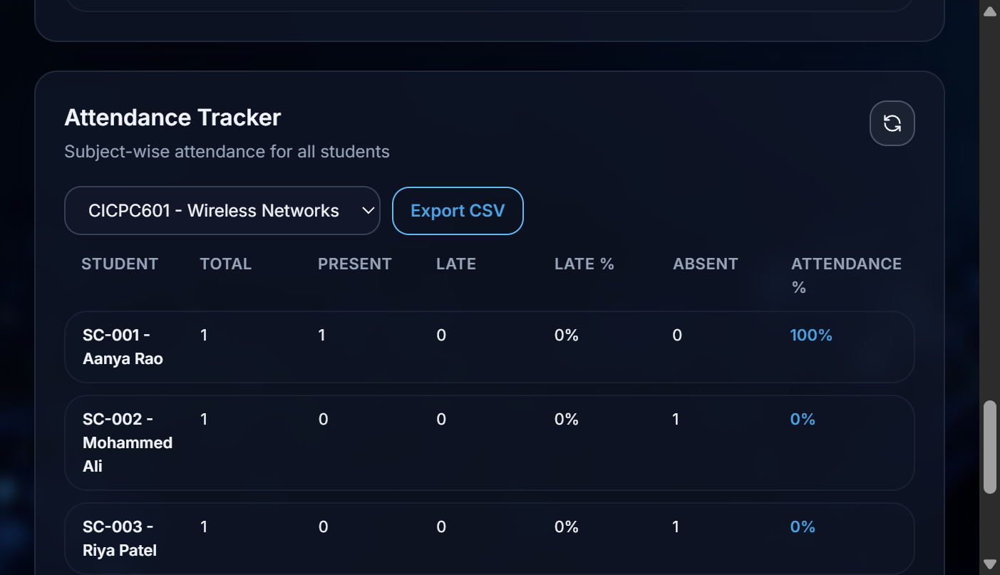
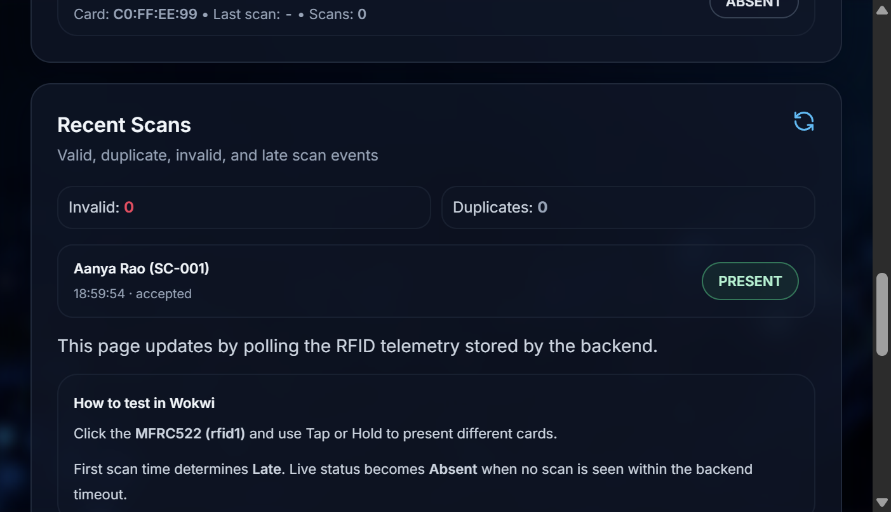

# Smart Classroom Frontend (Final Version)

Production-style React dashboard for the Smart Classroom project.

This frontend is the primary UI for:
- live classroom status and controls
- device grids (10 lights, 6 fans)
- AC monitoring/control
- temperature gauge + historical trend windows
- ML insights + AI report
- storage/pipeline health
- full Attendance Tracker workflow (RFID-backed via Wokwi)

---

## Screenshots

### Wokwi Simulation Running


### Home Dashboard - Status / Navigation / Pipeline


### Home Dashboard - Controls / Temperature / Analytics


### Attendance Session Controls


### Subject Management Overlay


### Attendance Tracker Table


### Recent Scans + Tracker Area


---

## System Architecture (Frontend Context)

End-to-end path:

`Wokwi -> MQTT -> Node-RED -> (HTTP APIs) -> React frontend`

Live Wokwi project used for verification: [Wireless Project Abdullah (Wokwi)](https://wokwi.com/projects/459287076267797505)

Persistence path:

`Node-RED -> storage bridge (:4050) -> JSON/JSONL runtime data`

Frontend runtime model:
- dashboard polling every `1000ms`; attendance polling every `2500ms`
- applies pipeline freshness debouncing to avoid flicker
- renders disconnects in chart as line gaps (`null` segments)
- supports fallback mock behavior if API calls fail

---

## Features in Final Working UI

### Home route
- header with Home / Attendance navigation
- status + alerts
- temperature gauge with NA on disconnect
- temperature trend with windows:
  - `1 min`, `5 min`, `10 min`, `1 hr`, `1 day`, `1 week`, `1 month`
- controls panel:
  - auto/manual mode
  - light/fan controls (legacy + expanded behavior compatible)
  - schedule toggle path integration
- classroom devices panel:
  - 10-light grid
  - 6-fan grid
- AC system panel:
  - power on/off
  - auto/manual (A/M)
  - setpoint apply
  - cooling active and related badges
- analytics panel
- ML insights panel
- AI report panel
- storage panel:
  - bridge status
  - ingest stats
  - clear storage/reset integrations

### Attendance route
- subject selection + session start/end
- subject editor overlay (add/update/remove subject code + name)
- live attendance KPIs (present/late/absent/%)
- invalid and duplicate counters
- recent scans feed
- searchable/filterable student table
- attendance tracker (subject-wise): total/present/late/late%/absent/attendance%
- attendance tracker reset icon (resets attendance data, keeps subject definitions)
- subject-wise CSV export from tracker dropdown

---

## Routes

This app uses hash-based routing in `App.tsx`:
- `#` or empty hash -> Home
- `#attendance` -> Attendance Tracker

---

## API Integration

### Node-RED APIs used by frontend
- `GET /api/telemetry`
- `GET /api/dashboard-summary`
- `GET /api/ml`
- `POST /api/command`
- `POST /api/ai-report`
- `POST /api/schedule-toggle`
- `GET /api/schedule-state`
- `GET /api/attendance`
- `GET /api/attendance/live`
- `POST /api/attendance/reset`
- `POST /api/attendance/session/start`
- `POST /api/attendance/session/end`
- `GET /api/attendance/export.csv`

### Storage APIs used by frontend
- `GET /api/storage/info`
- `GET /api/storage/temperature-trend`
- `POST /api/storage/clear`
- `POST /api/storage/downtime/reset`
- `GET /api/storage/occupancy-sessions`
- `PATCH /api/storage/occupancy-sessions/flag`
- `POST /api/storage/attendance/subjects`
- `PUT /api/storage/attendance/subjects`
- `DELETE /api/storage/attendance/subjects?code=...`
- `GET /api/storage/attendance/export.csv?subjectCode=...`

---

## Environment Variables

Create `.env` from `.env.example`:

```bash
cp .env.example .env
```

Variables:
- `VITE_API_BASE_URL`  
  Keep empty in local dev when using Vite proxy.
- `VITE_USE_MOCK`  
  `false` for real backend, `true` to force mock mode.

---

## Local Development

From `frontend/`:

```bash
npm install
npm run dev
```

Default Vite URL: `http://localhost:5173` (or next free port).

Build:

```bash
npm run build
```

Preview build:

```bash
npm run preview
```

---

## Required Backend Runtime for Full Functionality

For the UI to be fully live, run:
- Node-RED (APIs + MQTT integration)
- storage bridge on `:4050`
- Wokwi simulation publishing telemetry

Use the project root runbook:
- `../RUN-STEPS.txt`

---

## Vite Proxy (Current Defaults)

Configured in `vite.config.ts`:
- `/api` -> `http://127.0.0.1:1880` (Node-RED)
- `/api/storage` -> `http://127.0.0.1:4050` (storage bridge)

If your backend runs elsewhere, update proxy targets accordingly.

---

## Data + Connectivity Behavior

- Poll interval: `1000ms`
- Header pipeline indicator:
  - live/dead thresholds with debounce to avoid instant flips
- Gauge/chart behavior:
  - show `NA` when stream is not considered live
  - preserve timeline movement with disconnected line segments
- Clear storage behavior:
  - trend resets immediately
  - plotting resumes fresh on next live telemetry

---

## Attendance Hardware Mapping (Wokwi RFID)

Final card UID mapping used across frontend/backend/firmware:
- Blue Card -> `01:02:03:04`
- Green Card -> `11:22:33:44`
- Yellow Card -> `55:66:77:88`
- Red Card -> `AA:BB:CC:DD`
- NFC Tag -> `04:11:22:33`
- Key Fob -> `C0:FF:EE:99`

---

## Troubleshooting

### No live data in frontend
- ensure Node-RED is running on `:1880`
- ensure storage bridge is running on `:4050`
- ensure Wokwi is running and publishing to expected broker/topic
- verify Vite proxy targets

### AI Report keeps loading/failing
- check Node-RED `POST /api/ai-report` manually
- verify Groq env in Node-RED runtime (`GROQ_API_KEY`, optional model vars)
- review `docs/DOCKER-NODERED.md` in project root

### Attendance not updating
- ensure session is started from Attendance page
- scan known RFID card in Wokwi
- check `/api/attendance/live` response

### CORS/proxy path issues
- keep `VITE_API_BASE_URL` empty for local proxy mode
- if setting direct base URL, ensure backend allows origin and routes match

---

## Key Frontend Files

- `src/App.tsx` - route handling + page layout composition
- `src/hooks/useDashboardData.ts` - polling + trend/pipeline logic
- `src/hooks/useAttendanceData.ts` - attendance page data hooks
- `src/services/api.ts` - Node-RED API client
- `src/services/storageApi.ts` - storage bridge API client
- `src/types/dashboard.ts` - typed payload contracts
- `src/components/dashboard/*` - dashboard/attendance UI components
- `src/constants/pipeline.ts` - freshness thresholds + poll interval

---

## Final Notes

- This frontend is intentionally a thin client over Node-RED + storage bridge.
- Business logic remains backend-centric for compatibility and stability.
- UI design is aligned with the final Smart Classroom demo state and integrates
  all implemented phases (device expansion, AC, attendance, ML, AI, persistence).
